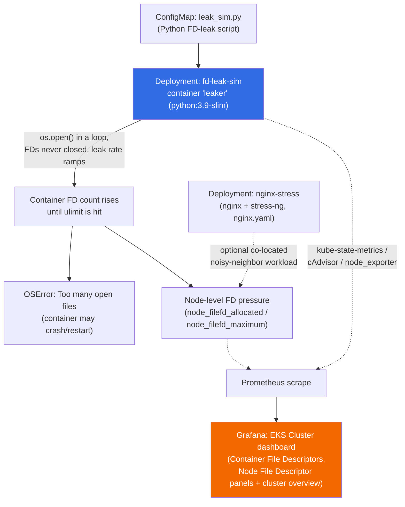

# FD Leak Simulator + EKS Observability Dashboard


## Executive Summary

This repository is a small, self-contained proof-of-concept that demonstrates **file descriptor (FD) exhaustion** as a Kubernetes failure mode, plus a companion **Grafana dashboard** used to observe it in an Amazon EKS cluster.

It contains two things:

1. **`k8-file-descriptors-simulator/`** — Kubernetes manifests that deploy a Python workload which deliberately opens file descriptors and never closes them, gradually ramping the leak rate until the container hits the OS file descriptor limit and starts throwing `OSError: [Errno 24] Too many open files`. A second manifest (`nginx.yaml`) deploys an unrelated nginx + `stress-ng` workload that can be run alongside the leak pod as a generic "noisy neighbor" to observe how a resource-exhaustion event on one pod/node affects others.
2. **A Grafana dashboard JSON export** (`EKS Cluster –  2026 MARCH 04-1772642044293.json`) for a Prometheus-backed EKS cluster. It is a general cluster-health dashboard (nodes, pods, CPU, memory, restarts) that also includes two panels specifically relevant to this scenario: **Node File Descriptor** and **Container File Descriptors**.

**Why this is useful:** FD leaks are a common, silent production failure — unlike CPU or memory pressure, they rarely show up until the process suddenly can't open a socket or file and the leak has already been present for a long time. This repo gives engineers a safe, reproducible way to trigger that failure mode in a real cluster and see exactly what it looks like on both the container level (`container_file_descriptors`) and the node level (`node_filefd_allocated`) in Grafana, before ever seeing it happen for real in production.

This is a **proof-of-concept / learning artifact**, not a packaged tool — there is no automation wiring the pod's metrics to the dashboard (no bundled Prometheus/exporter install, no CI, no Helm chart). See [Status & Roadmap](#status--roadmap).

## Architecture / Flow



The manifests do **not** wire up Prometheus/Grafana themselves — the diagram shows the intended observability path assuming a Prometheus stack (e.g. `kube-prometheus-stack`) with `node_exporter`, `kube-state-metrics`, and cAdvisor is already running in the target cluster, as is typical on EKS. See [Known Issues / Recommendations](#known-issues--recommendations).

## Repo Layout

| Path | Description |
|---|---|
| `README.md` | This file. |
| `EKS Cluster –  2026 MARCH 04-1772642044293.json` | Exported Grafana dashboard (schema v41, Grafana ~12.1.1) for a Prometheus-backed EKS cluster. General cluster overview + FD-specific panels. See [Grafana Dashboard](#grafana-dashboard) below. |
| `k8-file-descriptors-simulator/` | Kubernetes manifests for the FD-leak proof-of-concept. See its own [README](k8-file-descriptors-simulator/README.md). |
| `k8-file-descriptors-simulator/fd-leak-pod.yaml` | ConfigMap (leak script) + Deployment (`fd-leak-sim`) + Service that runs the FD-leaking Python container. |
| `k8-file-descriptors-simulator/nginx.yaml` | Standalone nginx + `stress-ng` Deployment and Service, usable as an optional co-located stress/noisy-neighbor workload. |

## How to Reproduce

Prerequisites: a Kubernetes cluster (EKS or otherwise) with `kubectl` configured, and — if you want to see the Grafana panels populate — a Prometheus stack (node_exporter, kube-state-metrics, cAdvisor) and Grafana already installed in or pointed at the cluster.

```bash
# 1. Deploy the FD-leak workload
kubectl apply -f k8-file-descriptors-simulator/fd-leak-pod.yaml

# 2. Watch the pod
kubectl get pods -w

# 3. Tail logs to watch the leak ramp
kubectl logs -f deployment/fd-leak-sim

# 4. Inspect open FDs inside the container directly
kubectl exec -it <pod-name> -- ls /proc/self/fd | wc -l

# 5. (Optional) deploy the noisy-neighbor nginx/stress-ng workload
kubectl apply -f k8-file-descriptors-simulator/nginx.yaml

# 6. Clean up
kubectl delete -f k8-file-descriptors-simulator/fd-leak-pod.yaml
kubectl delete -f k8-file-descriptors-simulator/nginx.yaml
```

> **Note:** `fd-leak-pod.yaml` pins `spec.nodeName: test`. Unless your cluster has a node literally named `test`, the pod will stay `Pending`. Remove or edit that line before applying — see [Known Issues](#known-issues--recommendations).

To load the dashboard: in Grafana, **Dashboards → New → Import**, upload `EKS Cluster –  2026 MARCH 04-1772642044293.json`, and map the `prometheus` datasource variable to your cluster's Prometheus datasource.

## Grafana Dashboard

The dashboard is titled **"EKS Cluster – 2026 MARCH 04"** (Grafana schema v41, refresh interval 5s, `namespace` template variable, one Prometheus datasource). It is a general-purpose EKS cluster overview dashboard, with two panels specifically applicable to the FD-leak scenario:

| Panel | PromQL (summarized) | Purpose |
|---|---|---|
| Nodes | `count(kube_node_info)` | Total node count |
| Ready Nodes | `sum(kube_node_status_condition{condition="Ready"})` | Healthy node count |
| Targets UP | `sum by (job) (up)` | Prometheus scrape target health |
| Total Pods | `count by (namespace) (kube_pod_info)` | Pod count per namespace |
| Running Pods | `sum(kube_pod_status_phase{phase="Running"})` | Running pod count |
| Cluster Memory Utilization % | `1 - MemAvailable/MemTotal` (cluster-wide) | Overall memory pressure |
| Total Memory Of EKS Nodes | `node_memory_MemTotal_bytes` | Cluster memory capacity |
| Total CPU Of EKS Nodes | `machine_cpu_cores` | Cluster CPU capacity |
| Cpu Absolute Usage In Cores for Containers | `rate(container_cpu_usage_seconds_total[5m])` | Per-pod CPU usage |
| Memory Absolute Usage for Containers | `container_memory_working_set_bytes` | Per-pod memory usage |
| **Container File Descriptors** | `container_file_descriptors{...}` | **FD count per container — the primary signal for this repo's leak scenario** |
| Node Used Memory (GB) | `MemTotal - MemAvailable` | Node memory in use |
| Node Used CPU cores | `rate(node_cpu_seconds_total{mode!="idle"}[2m])` | Node CPU in use |
| **Node File Descriptor** | `node_filefd_allocated` | **Node-wide allocated FDs — shows whether the leak is affecting the whole node, not just the container** |
| Pods Container Restarts Status | `increase(kube_pod_container_status_restarts_total[1h])` | Confirms whether Kubernetes restarted the leaking pod after it crashed |

The dashboard does not include `node_filefd_maximum` or a threshold/alert panel, so it shows *allocated* FDs but not FD usage as a *percentage of the limit* — see recommendations below.

## Security & Resource Considerations

- The `leaker` container in `fd-leak-pod.yaml` has resource requests/limits set (`100m`/`128Mi` limit, `50m`/`64Mi` request), which correctly bounds CPU/memory so the demo isolates FD exhaustion rather than also triggering an OOM kill or CPU throttle.
- The `nginx-stress` container in `nginx.yaml` also has requests/limits set (`500m`/`512Mi` limit, `100m`/`128Mi` request).
- Neither manifest sets a `securityContext` (no `runAsNonRoot`, no dropped capabilities, no read-only root filesystem). Both containers also run `apt-get install` at startup, which requires network egress and (depending on the base image/runtime) potentially root — acceptable for a throwaway lab pod, but not a pattern to copy into production manifests.
- No ConfigMap/Secret in this repo contains credentials.
- The Grafana JSON was reviewed for embedded secrets: it contains **no datasource URLs, API keys, tokens, or internal hostnames** — the datasource is referenced only by the generic name/UID `prometheus`, which is safe to keep public.
- Do not run this in a shared or production cluster: an FD leak that reaches the node-wide limit can affect **other pods scheduled on the same node**, not just the leaking container.

## Troubleshooting

| Symptom | Likely Cause | Fix |
|---|---|---|
| Pod stuck in `Pending` | `nodeName: test` in `fd-leak-pod.yaml` doesn't match any real node | Remove the `nodeName` field or set it to an actual node name (`kubectl get nodes`) |
| Pod stuck in `ContainerCreating` / crash on start | `apt-get update/install` at container start requires egress; slow or blocked networks will stall startup | Confirm the cluster/node has outbound internet access, or bake a custom image with `procps`/`stress-ng` pre-installed |
| No data in "Container File Descriptors" / "Node File Descriptor" panels | No Prometheus stack scraping `node_exporter` / cAdvisor / kube-state-metrics in the cluster, or the dashboard's `prometheus` datasource wasn't mapped on import | Install a Prometheus stack (e.g. `kube-prometheus-stack`) and re-map the datasource when importing the dashboard |
| Leak never triggers `Too many open files` | Container's `ulimit -n` is higher than expected, or pod was deleted/restarted before the ramp reached the limit | Let it run longer, or lower the container's FD ulimit (see the commented-out `securityContext` block in `fd-leak-pod.yaml`) |
| `kubectl logs` shows `apt-get` errors | `python:3.9-slim` / `nginx:latest` base image package index mismatch or transient network failure | Retry `kubectl rollout restart deployment/fd-leak-sim`, or pin package versions in the manifest |

## Known Issues / Recommendations

- **Hardcoded `nodeName: test`** in `fd-leak-pod.yaml` (`spec.template.spec.nodeName`) means the manifest will not schedule on a typical cluster out of the box. Recommend removing it (or making it a documented placeholder) so the manifest is usable as-is.
- **README previously referenced a non-existent `fd-leak.yaml`** — the actual manifest is `fd-leak-pod.yaml`. Fixed in this update.
- **Filename with special characters**: `EKS Cluster –  2026 MARCH 04-1772642044293.json` contains an en-dash, double spaces, and a raw browser-export timestamp suffix. This works fine with `git` and `kubectl`/Grafana import (nothing in this repo references it by exact path), but it is awkward to reference on the command line and may cause issues on tooling that is strict about filenames (e.g. some CI artifact uploaders, URL-based fetches). **Recommend renaming** to something like `dashboards/eks-cluster-overview.json` in a follow-up change, done as a deliberate `git mv` so history is preserved — not done in this pass to avoid changing a file outside the scope of a docs-only update.
- **No IaC/GitOps for the dashboard**: the JSON is a manual export; there's no `provisioning/` config, Terraform, or Grafonnet/Grafana-as-code source, so changes made in the Grafana UI won't automatically stay in sync with this file.
- **No automated metrics pipeline included**: this repo assumes Prometheus + node_exporter + kube-state-metrics + cAdvisor already exist in the target cluster; none of that is provisioned here.
- **Dashboard has no FD utilization % panel or alert rules**, only raw `node_filefd_allocated`. Adding `node_filefd_allocated / node_filefd_maximum` as a percentage panel (with a threshold, e.g. 80%) and a corresponding Grafana/Prometheus alert rule would make this a more complete reference for on-call use.
- **No `securityContext` hardening** on either container (see [Security & Resource Considerations](#security--resource-considerations)).
- **No license file** — add one if this repo is meant to be reused by others.

## Status & Roadmap

**What exists today:**
- [x] Working FD-leak Kubernetes manifest with resource limits
- [x] Companion nginx/stress-ng manifest for adjacent load
- [x] Exported Grafana dashboard with node- and container-level FD panels plus general cluster health panels

**Gaps / not yet done:**
- [ ] Prometheus/Alertmanager alert rules for FD exhaustion (dashboard has visualization only, no alerting)
- [ ] FD-utilization-percentage panel (`allocated / maximum`)
- [ ] Fix hardcoded `nodeName: test`
- [ ] `securityContext` hardening on both containers
- [ ] Dashboard-as-code (Grafonnet/Terraform) instead of a manual JSON export
- [ ] CI validation (e.g. `kubeval`/`kubeconform` manifest linting, JSON schema check on the dashboard)
- [ ] License file

## Disclaimer

This is a lab/learning project intended for **non-production clusters only**. Deliberately exhausting file descriptors can affect other workloads scheduled on the same node — do not run it in a shared or production environment without understanding the blast radius.
